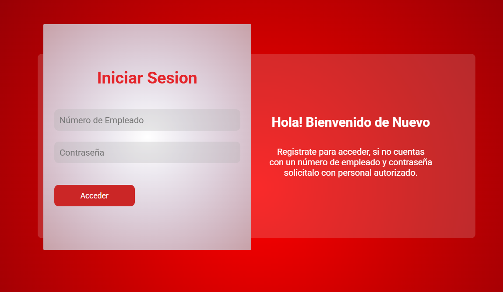
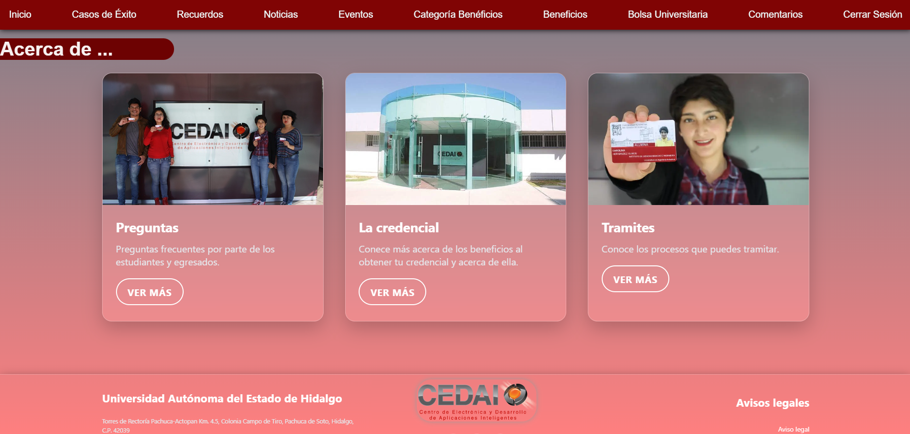
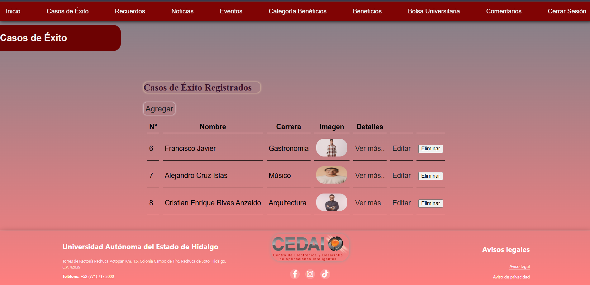
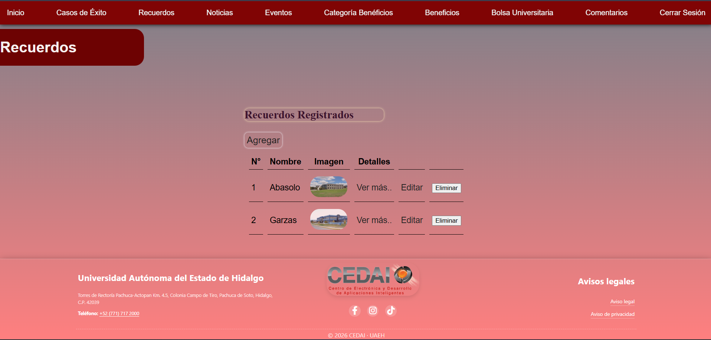
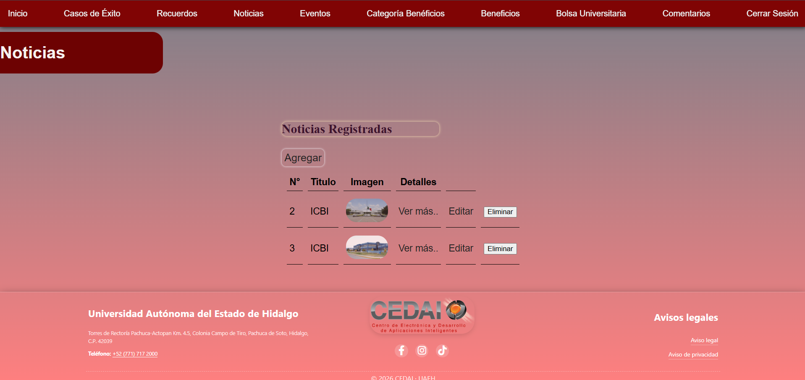
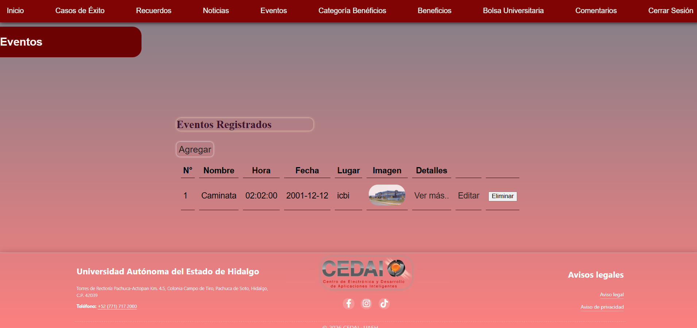
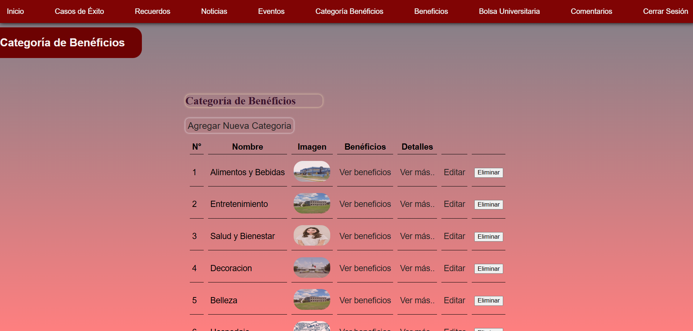
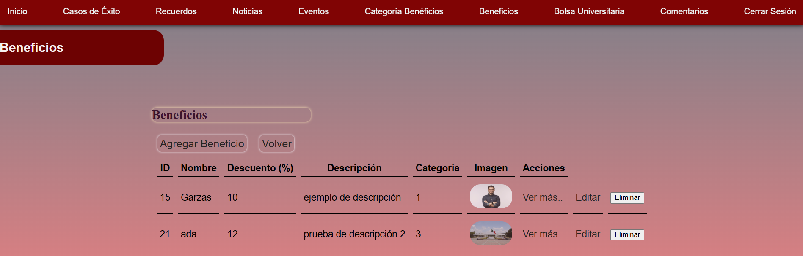
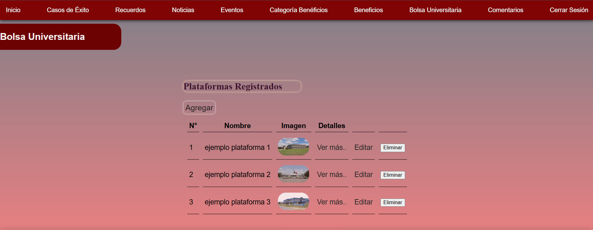
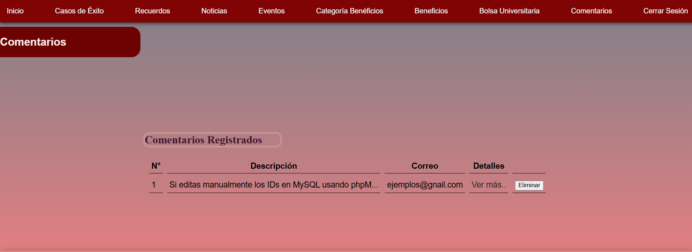

# CRUD — Panel de Administración Web

Sistema de administración web desarrollado para la gestión de contenido institucional.
Permite administrar noticias, eventos, beneficios, casos de éxito y más, con autenticación
de usuarios y operaciones CRUD completas.

---

## Tecnologías utilizadas

- **PHP** — Lógica del servidor y conexión a base de datos con PDO
- **JavaScript** — Peticiones asíncronas con AJAX
- **HTML5 / CSS3** — Estructura y estilos de la interfaz
- **MySQL** — Base de datos relacional
- **XAMPP** — Entorno de desarrollo local

---

## Estructura del proyecto

```
CRUD/
├── Assets/                 # Imagenes del proyecto
├── Beneficios/             # Módulo de beneficios (CRUD completo)
├── BolsaUniversitaria/     # Módulo de bolsa universitaria (CRUD completo)
├── CasosdeExito/           # Módulo de casos de éxito (CRUD completo)
├── CategoriaBeneficios/    # Módulo de categorías de beneficios (CRUD completo)
├── Comentarios/            # Módulo de comentarios
├── Eventos/                # Módulo de eventos (CRUD completo)
├── Noticias/               # Módulo de noticias (CRUD completo)
├── Recuerdos/              # Módulo de recuerdos (CRUD completo)
├── Inicio/                 # Autenticación y página de inicio
├── Partials/               # Componentes reutilizables (menú, footer)
├── Estilos/                # Archivos CSS globales y por módulo
├── conexion.example.php    # Plantilla de configuración de BD
└── index.php               # Punto de entrada / Login
```

Cada módulo sigue el patrón **MVC**:
- `controlador/` — Maneja las peticiones HTTP
- `modelos/` — Interactúa con la base de datos
- `Vista/` — Presenta la información al usuario
- `Js/` — Peticiones AJAX al controlador

---

## Instalación

### Requisitos
- XAMPP (PHP 7.4 o superior + MySQL)
- Navegador moderno

### Pasos

1. Clona el repositorio dentro de la carpeta `htdocs` de XAMPP:
```bash
   git clone https://github.com/TU_USUARIO/TU_REPO.git
```

2. Importa la base de datos en phpMyAdmin:
   - Abre `http://localhost/phpmyadmin`
   - Crea una base de datos llamada `casos_de_exito`
   - Importa el archivo `database.sql`

3. Configura la conexión:
```bash
   cp conexion.example.php conexion.php
```
   Edita `conexion.php` con tus credenciales de MySQL.

4. Accede desde el navegador:
```
   http://localhost/CRUD
```

---

## Acceso al sistema

El sistema cuenta con autenticación de usuarios. Para ingresar se requiere un nombre de usuario y contraseña proporcionados por personal autorizado.

---

## Módulos disponibles

| Módulo | Operaciones |
|---|---|
| Noticias | Agregar, Editar, Ver detalles, Eliminar |
| Eventos | Agregar, Editar, Ver detalles, Eliminar |
| Beneficios | Agregar, Editar, Ver detalles, Eliminar |
| Categoría Beneficios | Agregar, Editar, Ver detalles, Eliminar |
| Bolsa Universitaria | Agregar, Editar, Ver detalles, Eliminar |
| Casos de Éxito | Agregar, Editar, Ver detalles, Eliminar |
| Recuerdos | Agregar, Editar, Ver detalles, Eliminar |
| Comentarios | Ver, Ver detalles |

---
# CRUD Casos de Éxito

## Vista del proyecto

<h3>Login</h3>


<h3>Inicio</h3>


<h3>Casos de Éxito</h3>


<h3>Recuerdos</h3>


<h3>Noticias</h3>


<h3>Eventos</h3>


<h3>Categoria Beneficios</h3>


<h3>Beneficios</h3>


<h3>Bolsa Universitaria</h3>


<h3>Cometarios</h3>



## Autor

Desarrollado como proyecto de administración de contenido institucional.
